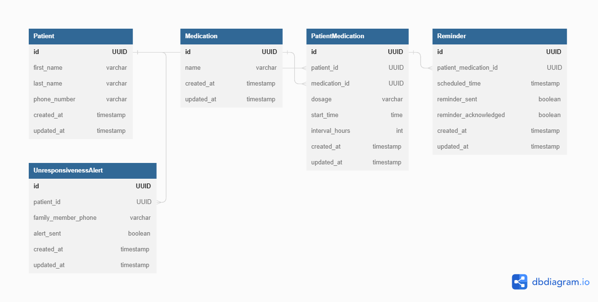

# med-minder

## Problem
Remembering to take your medication is hard, ensuring your love one knows that you are taking your medications is harder. (*TODO: Expand*)

## Solution
Make an application that solves the problem (*TODO: Expand*)

## Features

1. Medication List Management: The application must enable patients to input and manage their current medication list, including the name of the medication, dosage, and the specific times they take each medication.

2. SMS Reminders: The application must send SMS reminders to patients based on their medication schedule, notifying them of upcoming medication(s) they need to take.

3. Mark as Complete: The application must provide patients with the capability to acknowledge taking their medication, allowing the system to mark the respective medication as complete.

4. Unresponsiveness Alerts: The application must send an alert to a designated family member if the patient fails to respond to text alerts after a specified amount of time, indicating that the patient has not taken medication X in N hours.

5. Adaptive Scheduling: The application must adapt the medication schedule dynamically based on when the patient takes their medication in a given day, taking into account specific requirements such as time intervals between doses.

6. Medication Sheet Generation: The application must be able to generate a medication sheet containing all medications a patient is currently taking upon request.

7. Adding New Medications via SMS: The application must allow patients to add new medications to their list by sending an SMS message with the required information.

8. SMS-based Interactions: The application must support all interactions through SMS messaging until a frontend design is finalized and implemented.

9. Interactive Assistance (Future Feature): In the future, the application should be interactive, capable of checking in on the patient, providing helpful advice, and responding to inquiries as needed.

## Data-Model
